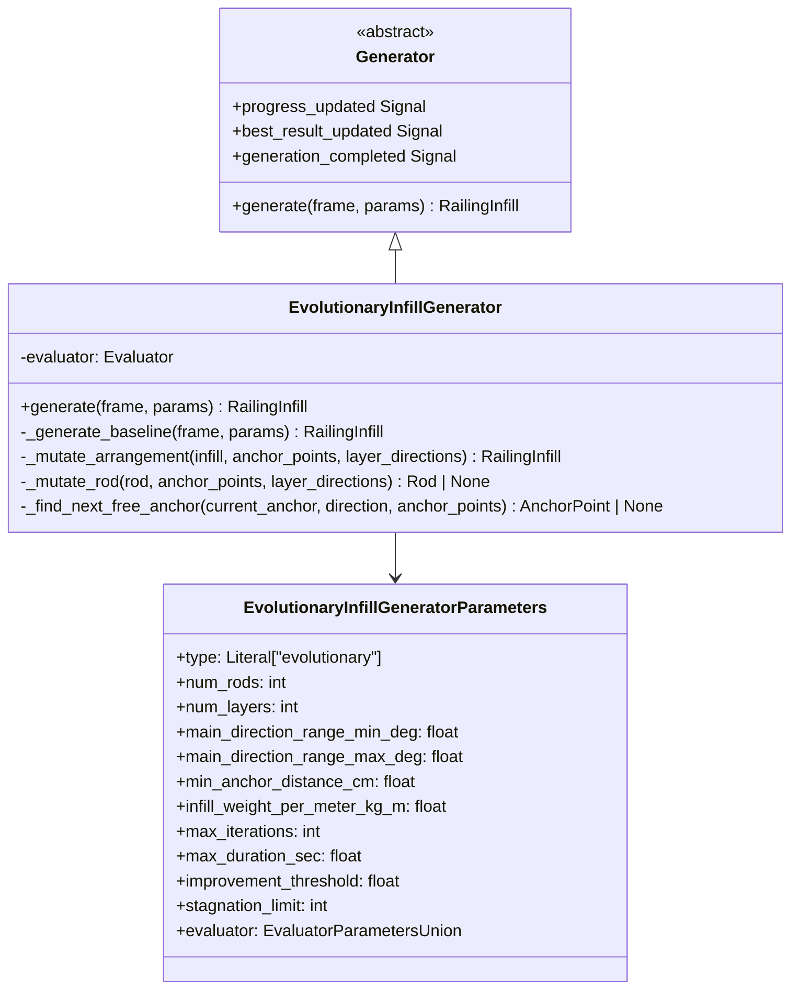

# Design Document: Evolutionary Infill Generator

## Overview

The Evolutionary Infill Generator is a hybrid generator that combines the structured baseline generation of the Uniform Directional Generator with iterative mutation and fitness-based selection. It starts with a deterministic uniform baseline, then iteratively applies random modifications to rod endpoints, keeping only changes that improve the fitness score.

### Key Characteristics

1. **Structured Baseline**: Uses uniform directional generation logic for initial arrangement
2. **Iterative Optimization**: Applies mutations and keeps improvements
3. **Fitness-Driven**: Uses the existing evaluator system (QualityEvaluator) for scoring
4. **Monotonic Improvement**: Solution quality never decreases
5. **Early Termination**: Stops on stagnation, max iterations, or max duration

### Reuse Strategy

This design maximizes reuse of existing components:

| Component | Reuse Approach |
|-----------|----------------|
| Anchor generation | Reuse `UniformDirectionalGenerator._generate_anchor_grid()` logic |
| Layer direction calculation | Reuse `UniformDirectionalGenerator._calculate_layer_directions()` logic |
| Baseline rod generation | Reuse `UniformDirectionalGenerator._generate_layer_rods()` logic |
| Fitness evaluation | Use existing `QualityEvaluator` directly |
| Parameter structure | Extend `UniformDirectionalGeneratorParameters` with evolutionary params |
| UI widget | Extend `UniformDirectionalGeneratorParameterWidget` with evolutionary fields |

## Architecture



## Components and Interfaces

### EvolutionaryInfillGeneratorDefaults (Dataclass)

Hydra configuration defaults loaded from YAML. Inherits baseline parameters from uniform directional and adds evolutionary-specific parameters:

```python
@dataclass
class EvolutionaryInfillGeneratorDefaults(InfillGeneratorDefaults):
    # Baseline parameters (same as UniformDirectionalGenerator)
    num_rods: int = 30
    num_layers: int = 3
    main_direction_range_min_deg: float = -45.0
    main_direction_range_max_deg: float = 25.0
    min_anchor_distance_cm: float = 5.0
    infill_weight_per_meter_kg_m: float = 0.59
    
    # Evolutionary parameters
    max_iterations: int = 1000
    max_duration_sec: float = 60.0
    improvement_threshold: float = 0.001
    stagnation_limit: int = 100
```

### EvolutionaryInfillGeneratorParameters (Pydantic Model)

Runtime parameters with validation:

```python
class EvolutionaryInfillGeneratorParameters(InfillGeneratorParameters):
    type: Literal["evolutionary"] = "evolutionary"
    
    # Baseline parameters (same as UniformDirectionalGenerator)
    num_rods: int = Field(ge=1, le=200, description="Total number of rods")
    num_layers: int = Field(ge=1, le=10, description="Number of rod layers")
    main_direction_range_min_deg: float = Field(ge=-90, le=90)
    main_direction_range_max_deg: float = Field(ge=-90, le=90)
    min_anchor_distance_cm: float = Field(gt=0)
    infill_weight_per_meter_kg_m: float = Field(gt=0)
    
    # Evolutionary parameters
    max_iterations: int = Field(ge=1, le=100000, description="Maximum iterations")
    max_duration_sec: float = Field(gt=0, description="Maximum duration in seconds")
    improvement_threshold: float = Field(ge=0, le=1, description="Minimum fitness improvement to accept")
    stagnation_limit: int = Field(ge=1, description="Iterations without improvement before stopping")
    
    # Nested evaluator (same as UniformDirectionalGenerator)
    evaluator: EvaluatorParametersUnion = Field(discriminator="type")
    
    @model_validator(mode='after')
    def validate_direction_range(self) -> Self:
        if self.main_direction_range_min_deg >= self.main_direction_range_max_deg:
            raise ValueError("min_deg must be less than max_deg")
        return self
```

### EvolutionaryInfillGenerator Class

Main generator implementation:

```python
class EvolutionaryInfillGenerator(Generator):
    PARAMETER_TYPE = EvolutionaryInfillGeneratorParameters
    
    def generate(self, frame: RailingFrame, params: InfillGeneratorParameters) -> RailingInfill:
        """Generate optimized infill using evolutionary approach."""
        ...
```

## Data Models

### Parameters

| Parameter | Type | Default | Constraints | Description |
|-----------|------|---------|-------------|-------------|
| type | Literal | "evolutionary" | Fixed | Generator type identifier |
| num_rods | int | 30 | [1, 200] | Total rods to generate |
| num_layers | int | 3 | [1, 10] | Number of layers |
| main_direction_range_min_deg | float | -45.0 | [-90, 90] | Min direction angle |
| main_direction_range_max_deg | float | 25.0 | [-90, 90] | Max direction angle |
| min_anchor_distance_cm | float | 5.0 | > 0 | Minimum anchor spacing |
| infill_weight_per_meter_kg_m | float | 0.59 | > 0 | Rod weight per meter |
| max_iterations | int | 1000 | [1, 100000] | Maximum iterations |
| max_duration_sec | float | 60.0 | > 0 | Maximum duration |
| improvement_threshold | float | 0.001 | [0, 1] | Min fitness improvement |
| stagnation_limit | int | 100 | >= 1 | Iterations before stagnation |
| evaluator | EvaluatorParametersUnion | Quality | - | Nested evaluator config |

## Algorithm Overview

### Phase 1: Generate Baseline

Reuse the uniform directional generation logic to create a structured starting point.

**Algorithm:**
1. Generate anchor grid using `_generate_anchor_grid()` (same as UniformDirectionalGenerator)
2. Calculate layer directions using `_calculate_layer_directions()` (same as UniformDirectionalGenerator)
3. Generate baseline rods using `_generate_layer_rods()` (same as UniformDirectionalGenerator)
4. Evaluate baseline fitness using configured evaluator
5. Emit `best_result_updated` signal with baseline

**Requirements: 1.1, 1.2, 1.3, 1.4, 1.5, 2.1**

### Phase 2: Evolutionary Optimization Loop

Iteratively mutate and select improvements.

**Algorithm:**
```
current_best = baseline
best_fitness = evaluate(baseline)
stagnation_counter = 0

while not should_stop():
    # Create a copy of current arrangement for mutation
    mutated = deep_copy(current_best)
    mutated_anchors = deep_copy(anchor_points)
    
    # Mutate all layers
    for layer in 1..num_layers:
        for rod in mutated.rods where rod.layer == layer:
            mutate_rod(rod, mutated_anchors, layer_directions)
    
    # Evaluate mutated arrangement
    mutated_fitness = evaluate(mutated)
    
    # Selection: keep if improved
    if mutated_fitness > best_fitness + improvement_threshold:
        current_best = mutated
        anchor_points = mutated_anchors
        best_fitness = mutated_fitness
        stagnation_counter = 0
        emit best_result_updated(current_best)
    else:
        stagnation_counter += 1
    
    emit progress_updated(iteration, elapsed)
    
    # Check termination conditions
    if stagnation_counter >= stagnation_limit:
        break

emit generation_completed(current_best)
return current_best
```

**Requirements: 3.1, 3.2, 3.3, 3.4, 3.5, 3.6, 3.7, 3.8, 4.1, 4.2, 4.3, 4.4, 4.5, 5.1, 5.2, 5.3, 5.4, 5.5, 5.6**

### Phase 3: Rod Mutation

Mutate a single rod by moving its endpoints to neighboring free anchors.

**Algorithm:**
```python
def mutate_rod(rod, anchor_points, layer_directions):
    original_start_anchor = find_anchor_at(rod.start, anchor_points)
    original_end_anchor = find_anchor_at(rod.end, anchor_points)
    
    # Choose random direction (clockwise or counterclockwise)
    direction = random.choice(["cw", "ccw"])
    
    # Find next free anchors for both endpoints
    new_start_anchor = find_next_free_anchor(original_start_anchor, direction, anchor_points)
    new_end_anchor = find_next_free_anchor(original_end_anchor, direction, anchor_points)
    
    if new_start_anchor is None or new_end_anchor is None:
        return  # No mutation possible, keep original
    
    if new_start_anchor == new_end_anchor:
        return  # Would create zero-length rod, keep original
    
    # Create mutated rod
    mutated_rod = create_rod(new_start_anchor.position, new_end_anchor.position, rod.layer)
    
    # Check for same-layer crossings
    if crosses_same_layer_rod(mutated_rod, layer_rods):
        return  # Undo mutation, keep original
    
    # Apply mutation
    release_anchor(original_start_anchor)  # Mark free, clear layer
    release_anchor(original_end_anchor)    # Mark free, clear layer
    claim_anchor(new_start_anchor, rod.layer)  # Mark used, set layer
    claim_anchor(new_end_anchor, rod.layer)    # Mark used, set layer
    
    # Update rod geometry
    rod.geometry = mutated_rod.geometry
```

**Requirements: 2.2, 2.3, 2.4, 2.5, 3.1, 3.2, 3.3, 3.4, 3.5, 3.6, 3.7**

### Helper: Find Next Free Anchor

Find the nearest free anchor point along the frame boundary.

**Algorithm:**
```python
def find_next_free_anchor(current_anchor, direction, anchor_points):
    # Sort anchors by position along frame boundary
    sorted_anchors = sort_by_boundary_position(anchor_points)
    
    current_index = sorted_anchors.index(current_anchor)
    
    if direction == "cw":
        # Search forward (wrapping around)
        for i in range(1, len(sorted_anchors)):
            idx = (current_index + i) % len(sorted_anchors)
            if not sorted_anchors[idx].used:
                return sorted_anchors[idx]
    else:  # ccw
        # Search backward (wrapping around)
        for i in range(1, len(sorted_anchors)):
            idx = (current_index - i) % len(sorted_anchors)
            if not sorted_anchors[idx].used:
                return sorted_anchors[idx]
    
    return None  # No free anchor found
```

**Requirements: 3.2, 3.3**

## Error Handling

### Validation Errors

| Condition | Error |
|-----------|-------|
| `num_rods <= 0` | Pydantic ValidationError |
| `num_layers <= 0` | Pydantic ValidationError |
| `min_deg >= max_deg` | Pydantic ValidationError |
| `max_iterations <= 0` | Pydantic ValidationError |
| `stagnation_limit <= 0` | Pydantic ValidationError |

### Generation Errors

| Condition | Behavior |
|-----------|----------|
| Frame too small for baseline | RuntimeError (fail-fast, same as UniformDirectionalGenerator) |
| Cancellation requested | Return current best result |
| Max iterations reached | Return current best result |
| Max duration exceeded | Return current best result |
| Stagnation limit reached | Return current best result |


## Correctness Properties

*A property is a characteristic or behavior that should hold true across all valid executions of a system-essentially, a formal statement about what the system should do. Properties serve as the bridge between human-readable specifications and machine-verifiable correctness guarantees.*

### Property Reflection

After analyzing the acceptance criteria, I identified the following consolidations:
- Properties 1.2, 1.3 relate to baseline structure - combined into Property 1
- Properties 2.1, 2.2 relate to anchor count invariance - combined into Property 2
- Properties 2.3, 2.4, 2.5, 3.4, 3.5 relate to anchor state management - combined into Property 3
- Properties 3.6, 7.3 relate to no same-layer crossings - combined into Property 4
- Properties 4.2, 4.3 relate to fitness monotonicity - combined into Property 5
- Properties 7.1, 7.2 relate to rod boundary constraints - combined into Property 6
- Properties 7.4 relates to anchor distance - Property 7
- Properties 5.3, 5.4 relate to termination limits - combined into Property 8
- Properties 8.3, 9.1-9.6 relate to parameter validation - combined into Property 9
- Properties 12.1, 12.2 relate to serialization round-trip - combined into Property 10

### Property 1: Baseline Layer Distribution

*For any* generated baseline with N rods and L layers, the difference between the layer with the most rods and the layer with the fewest rods SHALL be at most 1, and layer directions SHALL follow linear interpolation across the configured direction range.

**Validates: Requirements 1.2, 1.3**

### Property 2: Anchor Count Invariance

*For any* generation run, the total number of anchor points SHALL remain constant from baseline creation through all mutation iterations.

**Validates: Requirements 2.1, 2.2**

### Property 3: Anchor State Consistency

*For any* generated infill, the number of used anchor points SHALL equal exactly twice the number of rods (each rod uses two anchors), and all used anchors SHALL have a layer assignment matching their connected rod.

**Validates: Requirements 2.3, 2.4, 2.5**

### Property 4: No Same-Layer Crossings

*For any* generated infill (baseline or after mutations), no two rods in the same layer SHALL cross each other.

**Validates: Requirements 3.6, 7.3**

### Property 5: Fitness Monotonicity

*For any* generation run, the fitness score of the returned result SHALL be greater than or equal to the baseline fitness score.

**Validates: Requirements 4.2, 4.3**

### Property 6: Rod Boundary Constraints

*For any* generated rod, both endpoints SHALL lie on the frame boundary, and the entire rod geometry SHALL be within the frame boundary.

**Validates: Requirements 7.1, 7.2**

### Property 7: Minimum Anchor Distance

*For any* generated infill, all pairs of anchor points SHALL be separated by at least min_anchor_distance_cm.

**Validates: Requirements 7.4**

### Property 8: Termination Limits

*For any* generation run, the iteration count SHALL not exceed max_iterations, and the duration SHALL not significantly exceed max_duration_sec.

**Validates: Requirements 5.3, 5.4**

### Property 9: Parameter Validation

*For any* parameter values where direction range min >= max, or any value is outside its valid range, parameter creation SHALL raise a validation error.

**Validates: Requirements 8.3, 9.1-9.6**

### Property 10: Serialization Round-Trip

*For any* valid EvolutionaryInfillGeneratorParameters, serializing to JSON and deserializing SHALL produce an equivalent object.

**Validates: Requirements 12.1, 12.2**

## Testing Strategy

### Property-Based Testing

The implementation will use **Hypothesis** for property-based testing, consistent with the existing codebase.

Each correctness property will be implemented as a property-based test:
- Tests will be annotated with the format: `**Feature: evolutionary-infill-generator, Property N: <property_text>**`
- Each property test will run a minimum of 100 iterations
- Generators will produce valid parameter ranges

### Unit Tests

Unit tests will cover:
- Default value loading from configuration
- Factory registration and generator creation
- Edge cases (single iteration, immediate stagnation)
- Error conditions (invalid parameters, frame too small)
- Signal emission verification

### Test File Structure

```
tests/domain/infill_generators/
├── test_evolutionary_infill_generator.py           # Unit tests
└── test_evolutionary_infill_generator_properties.py  # Property-based tests
```

## Configuration Files

### Hydra Configuration

File: `conf/generators/evolutionary.yaml`

```yaml
# Baseline parameters (same as uniform_directional)
num_rods: 30
num_layers: 3
main_direction_range_min_deg: -45.0
main_direction_range_max_deg: 25.0
min_anchor_distance_cm: 5.0
infill_weight_per_meter_kg_m: 0.59

# Evolutionary parameters
max_iterations: 1000
max_duration_sec: 60.0
improvement_threshold: 0.001
stagnation_limit: 100
```

## UI Integration

### Parameter Widget

Create `EvolutionaryInfillGeneratorParameterWidget` extending the pattern from `UniformDirectionalGeneratorParameterWidget`:

**Input Fields (Baseline - same as UniformDirectionalGenerator):**
- Number of Rods (QSpinBox, 1-200)
- Number of Layers (QSpinBox, 1-10)
- Direction Range Min (QDoubleSpinBox, -90 to 90)
- Direction Range Max (QDoubleSpinBox, -90 to 90)
- Min Anchor Distance (QDoubleSpinBox, 0.1-100 cm)
- Infill Weight per Meter (QDoubleSpinBox, 0.01-10 kg/m)

**Input Fields (Evolutionary - new):**
- Max Iterations (QSpinBox, 1-100000)
- Max Duration (QDoubleSpinBox, 1-3600 sec)
- Improvement Threshold (QDoubleSpinBox, 0-1)
- Stagnation Limit (QSpinBox, 1-10000)

**Input Fields (Evaluator - same as UniformDirectionalGenerator):**
- Evaluator Type (QComboBox with nested widget)

### Factory Registration

Register in `GeneratorFactory`:
- Key: "evolutionary"
- Value: EvolutionaryInfillGenerator class

## Performance Characteristics

### Time Complexity

- Baseline generation: O(N * L) where N = num_rods, L = num_layers (same as UniformDirectionalGenerator)
- Per mutation iteration: O(N * L) for processing all rods
- Total: O(I * N * L) where I = iterations

### Memory Usage

- Anchor points: ~N * 64 bytes (same as UniformDirectionalGenerator)
- Rods: ~N * 256 bytes
- Copy for mutation: ~N * 256 bytes (temporary)
- **Total: < 100 KB for typical cases**

### Expected Behavior

| Scenario | Expected Iterations | Expected Duration |
|----------|---------------------|-------------------|
| Good baseline | 10-50 | < 1 sec |
| Moderate improvement | 100-500 | 1-10 sec |
| Difficult optimization | 500-1000 | 10-60 sec |
| Stagnation | stagnation_limit | varies |

## Summary

The Evolutionary Infill Generator provides:

1. **Structured baseline** using proven uniform directional logic
2. **Iterative optimization** through mutation and selection
3. **Monotonic improvement** - solution quality never decreases
4. **Configurable termination** via iterations, duration, or stagnation
5. **Full integration** with existing evaluator and UI systems
6. **Maximum code reuse** from UniformDirectionalGenerator
