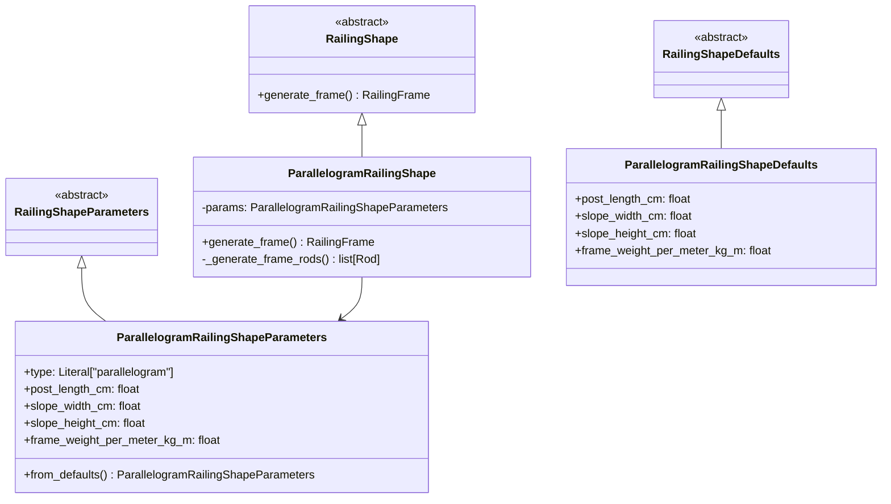

# Design Document: Parallelogram Railing Shape

## Overview

The Parallelogram Railing Shape is a new shape type for the railing infill generator that creates a four-sided frame where the top (handrail) and bottom edges are parallel angled lines connected by two vertical posts. This shape is ideal for continuous slope railings such as ramps and inclined walkways.

### Geometry

```
                    (slope_width, slope_height + post_length)
                   /|
                  / |
    Handrail    /  | Right Post
               /   |
              /    |
(0, post_length)   (slope_width, slope_height)
    |             /
    | Left      /
    | Post     / Bottom Rail
    |         /
    |        /
(0, 0)------/
```

The parallelogram is defined by:
- **Left Post**: Vertical line from (0, 0) to (0, post_length_cm)
- **Handrail**: Angled line from (0, post_length_cm) to (slope_width_cm, slope_height_cm + post_length_cm)
- **Right Post**: Vertical line from (slope_width_cm, slope_height_cm + post_length_cm) to (slope_width_cm, slope_height_cm)
- **Bottom Rail**: Angled line from (slope_width_cm, slope_height_cm) to (0, 0), parallel to handrail

## Architecture

The implementation follows the existing shape architecture pattern:



## Components and Interfaces

### ParallelogramRailingShapeDefaults (Dataclass)

Hydra configuration defaults loaded from YAML:

```python
@dataclass
class ParallelogramRailingShapeDefaults(RailingShapeDefaults):
    post_length_cm: float = 100.0
    slope_width_cm: float = 300.0
    slope_height_cm: float = 150.0
    frame_weight_per_meter_kg_m: float = 0.5
```

### ParallelogramRailingShapeParameters (Pydantic Model)

Runtime parameters with validation:

```python
class ParallelogramRailingShapeParameters(RailingShapeParameters):
    type: Literal["parallelogram"] = "parallelogram"
    post_length_cm: float = Field(gt=0, description="Post length in cm")
    slope_width_cm: float = Field(gt=0, description="Horizontal distance between posts in cm")
    slope_height_cm: float = Field(gt=0, description="Vertical rise from left to right post base in cm")
    frame_weight_per_meter_kg_m: float = Field(gt=0, description="Frame weight per meter")
    
    @classmethod
    def from_defaults(cls, defaults: ParallelogramRailingShapeDefaults) -> "ParallelogramRailingShapeParameters":
        ...
```

### ParallelogramRailingShape (Shape Implementation)

Generates the frame geometry:

```python
class ParallelogramRailingShape(RailingShape):
    def __init__(self, params: ParallelogramRailingShapeParameters):
        self.params = params
    
    def generate_frame(self) -> RailingFrame:
        frame_rods = self._generate_frame_rods()
        return RailingFrame(rods=frame_rods)
    
    def _generate_frame_rods(self) -> list[Rod]:
        # Returns 4 rods: left post, handrail, right post, bottom rail
        ...
```

### Factory Registration

The shape will be registered in `RailingShapeFactory`:

```python
_SHAPE_REGISTRY: dict[str, type[RailingShape]] = {
    "staircase": StaircaseRailingShape,
    "rectangular": RectangularRailingShape,
    "parallelogram": ParallelogramRailingShape,  # New
}
```

## Data Models

### Parameters

| Parameter | Type | Constraints | Description |
|-----------|------|-------------|-------------|
| type | Literal["parallelogram"] | Fixed value | Shape type identifier |
| post_length_cm | float | > 0 | Vertical height of each post |
| slope_width_cm | float | > 0 | Horizontal distance between posts |
| slope_height_cm | float | > 0 | Vertical rise from left to right |
| frame_weight_per_meter_kg_m | float | > 0 | Weight per meter of frame material |

### Default Values (YAML Configuration)

File: `conf/shapes/parallelogram.yaml`

```yaml
post_length_cm: 100.0
slope_width_cm: 300.0
slope_height_cm: 150.0
frame_weight_per_meter_kg_m: 0.5
```

## Correctness Properties

*A property is a characteristic or behavior that should hold true across all valid executions of a system-essentially, a formal statement about what the system should do. Properties serve as the bridge between human-readable specifications and machine-verifiable correctness guarantees.*

### Property Reflection

After analyzing the acceptance criteria, I identified the following consolidations:
- Properties 1.1-1.5 all relate to frame geometry - they can remain separate as they test distinct geometric constraints
- Properties 2.1-2.4 (positive value acceptance) are redundant - they can be combined into a single property testing that any positive values are accepted
- Property 2.5 (rejection of invalid values) is the inverse and should remain separate
- Properties 4.1 and 4.2 form a round-trip and should be combined into one property

### Property 1: Frame Rod Count

*For any* valid ParallelogramRailingShapeParameters, generating a frame SHALL produce exactly 4 rods.

**Validates: Requirements 1.1**

### Property 2: Handrail and Bottom Rail Parallelism

*For any* valid ParallelogramRailingShapeParameters, the handrail and bottom rail SHALL have identical slopes (be parallel).

**Validates: Requirements 1.2**

### Property 3: Posts Are Vertical

*For any* valid ParallelogramRailingShapeParameters, both the left and right posts SHALL be vertical (start and end x-coordinates are equal for each post).

**Validates: Requirements 1.3**

### Property 4: Left Post Position

*For any* valid ParallelogramRailingShapeParameters, the left post SHALL start at (0, 0) and end at (0, post_length_cm).

**Validates: Requirements 1.4**

### Property 5: Right Post Base Position

*For any* valid ParallelogramRailingShapeParameters, the right post base SHALL be at (slope_width_cm, slope_height_cm).

**Validates: Requirements 1.5**

### Property 6: Positive Parameters Accepted

*For any* set of positive values for post_length_cm, slope_width_cm, slope_height_cm, and frame_weight_per_meter_kg_m, creating ParallelogramRailingShapeParameters SHALL succeed without validation errors.

**Validates: Requirements 2.1, 2.2, 2.3, 2.4**

### Property 7: Invalid Parameters Rejected

*For any* parameter value that is zero or negative, creating ParallelogramRailingShapeParameters SHALL raise a validation error.

**Validates: Requirements 2.5**

### Property 8: Serialization Round-Trip

*For any* valid ParallelogramRailingShapeParameters, serializing to JSON and deserializing back SHALL produce parameters equal to the original.

**Validates: Requirements 4.1, 4.2**

## Error Handling

| Error Condition | Handling |
|-----------------|----------|
| Zero or negative parameter values | Pydantic validation raises `ValidationError` with descriptive message |
| Unknown shape type in factory | `ValueError` with list of available types |
| Parameter type mismatch in factory | `ValueError` indicating expected parameter type |

## Testing Strategy

### Property-Based Testing

The implementation will use **Hypothesis** for property-based testing, consistent with Python best practices.

Each correctness property will be implemented as a property-based test:
- Tests will be annotated with the format: `**Feature: parallelogram-railing-shape, Property N: <property_text>**`
- Each property test will run a minimum of 100 iterations
- Generators will produce valid parameter ranges (positive floats within reasonable bounds)

### Unit Tests

Unit tests will cover:
- Default value loading from configuration
- Factory registration and shape creation
- Edge cases for parameter validation

### Test File Structure

```
tests/domain/shapes/
├── test_parallelogram_railing_shape.py          # Unit tests
└── test_parallelogram_railing_shape_properties.py  # Property-based tests
```
