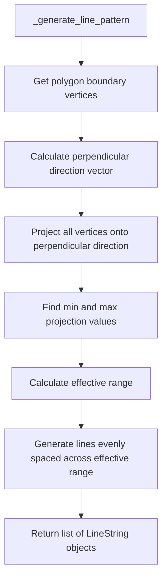

# Design Document: Uniform Directional Generator Fix

## Overview

This design document describes the fix for the rod distribution issue in the Uniform Directional Generator. The current implementation creates gaps at the edges of the frame because it calculates line positions based on the bounding box center rather than the actual polygon extent in the perpendicular direction.

### Problem Analysis

The current `_generate_line_pattern()` method:
1. Gets the bounding box of the frame
2. Calculates the center of the bounding box
3. Projects bounding box corners onto the perpendicular direction to find the extent
4. Spaces lines evenly across this extent

The issue is that for non-rectangular frames (like parallelograms), the polygon extent includes corners where lines only touch the polygon at a single point, not two points needed for a valid rod. This causes:
- Lines at the edges to be invalid (only one intersection point)
- Gaps at the edges where valid rods cannot be created
- Uneven visual distribution of rods

For example, in a parallelogram with a slanted left edge:
- The polygon extent for vertical lines goes from x=0 (bottom-left corner) to x=500 (top-right corner)
- But valid vertical lines (that intersect at two points) only exist between x=100 and x=400
- Lines at x < 100 or x > 400 only touch the polygon at one point (a corner)

### Solution

The fix modifies the line pattern generation to:
1. **Calculate the valid line range** where lines actually intersect the boundary at two points
2. **Find the overlap region** between opposite edges of the polygon in the perpendicular direction
3. **Space lines evenly** across this valid range

This ensures that:
- The first line is at the first position where it intersects the boundary at two points
- The last line is at the last position where it intersects the boundary at two points
- All generated lines produce valid rods (two intersection points)
- Lines are evenly distributed across the entire valid area

## Architecture

The fix modifies the existing `UniformDirectionalGenerator` class without changing its interface or adding new classes.



## Components and Interfaces

### Modified Method: `_generate_line_pattern()`

The method signature remains unchanged:

```python
def _generate_line_pattern(
    self,
    frame: RailingFrame,
    direction_deg: float,
    num_lines: int,
) -> list[LineString]:
```

### New Helper Method: `_calculate_polygon_extent()`

A new private method to calculate the actual polygon extent in a given direction:

```python
def _calculate_polygon_extent(
    self,
    polygon: Polygon,
    perpendicular_direction: tuple[float, float],
) -> tuple[float, float]:
    """
    Calculate the extent of a polygon when projected onto a direction.
    
    Args:
        polygon: The polygon to analyze
        perpendicular_direction: Unit vector (dx, dy) for the projection direction
    
    Returns:
        Tuple of (min_projection, max_projection) values
    """
```

## Algorithm Details

### Step 1: Calculate Perpendicular Direction

Given a layer direction angle `direction_deg` (where 0° = vertical, positive = clockwise):

```python
import math

angle_rad = math.radians(direction_deg)

# Line direction vector (along the rod direction)
line_dx = math.sin(angle_rad)  # For 0°: 0
line_dy = math.cos(angle_rad)  # For 0°: 1

# Perpendicular direction (90° counterclockwise from line direction)
perp_dx = -line_dy  # = -cos(angle)
perp_dy = line_dx   # = sin(angle)
```

### Step 2: Project Polygon Vertices

For each vertex `(vx, vy)` of the polygon boundary, calculate its projection onto the perpendicular direction:

```python
projection = vx * perp_dx + vy * perp_dy
```

This gives a scalar value representing how far along the perpendicular direction the vertex lies.

### Step 3: Find Valid Line Range

The key insight is that for non-rectangular polygons, the polygon extent includes corners where lines only touch at one point. We need to find the **valid range** where lines intersect the boundary at two points.

For a convex polygon, this is the **overlap region** between opposite edges when projected onto the perpendicular direction:

```python
# Group edges by their orientation relative to the line direction
# Edges are "top" if they face the positive perpendicular direction
# Edges are "bottom" if they face the negative perpendicular direction

# For each edge, calculate its projection range onto the perpendicular direction
# The valid line range is where top and bottom edges overlap

# Find the maximum of all "bottom" edge min projections
# Find the minimum of all "top" edge max projections
# The valid range is [max_bottom_min, min_top_max]

valid_min = max(bottom_edge_min_projections)
valid_max = min(top_edge_max_projections)
effective_range = valid_max - valid_min
```

### Step 4: Generate Evenly Spaced Lines

For `num_lines` lines, calculate the offset for each line within the **valid range**:

```python
if num_lines == 1:
    # Single line at the center of the valid range
    offsets = [(valid_min + valid_max) / 2]
else:
    # Multiple lines evenly spaced from valid_min to valid_max
    spacing = effective_range / (num_lines - 1)
    offsets = [valid_min + i * spacing for i in range(num_lines)]
```

### Step 5: Create Line Geometries

For each offset, create a line that:
1. Passes through a point at that offset in the perpendicular direction
2. Extends in the line direction far enough to span the polygon

```python
# Calculate a point on the line at the given offset
# Using the polygon centroid as a reference point
centroid = polygon.centroid
ref_x, ref_y = centroid.x, centroid.y

# Project centroid onto perpendicular direction
centroid_proj = ref_x * perp_dx + ref_y * perp_dy

# Calculate the point at the desired offset
offset_diff = offset - centroid_proj
point_x = ref_x + offset_diff * perp_dx
point_y = ref_y + offset_diff * perp_dy

# Create line extending in both directions
diagonal = sqrt(width**2 + height**2)  # From bounding box
start_x = point_x - line_dx * diagonal
start_y = point_y - line_dy * diagonal
end_x = point_x + line_dx * diagonal
end_y = point_y + line_dy * diagonal

line = LineString([(start_x, start_y), (end_x, end_y)])
```

## Data Models

No new data models are required. The fix only modifies the internal algorithm of the existing generator.

## Correctness Properties

*A property is a characteristic or behavior that should hold true across all valid executions of a system-essentially, a formal statement about what the system should do. Properties serve as the bridge between human-readable specifications and machine-verifiable correctness guarantees.*

### Property Reflection

After analyzing the acceptance criteria:
- Properties 1.1, 1.2 relate to extent calculation - combined into Property 1
- Properties 1.3, 1.4, 1.5, 2.3 relate to even distribution - combined into Property 2
- Property 2.1 relates to parallelogram handling - combined with Property 2
- Property 2.2 is a regression test - kept as example test
- Properties 3.1, 3.2 are non-functional - not testable
- Property 3.3 is already covered by existing Property 1 (determinism)

### Property 1: Polygon Extent Calculation

*For any* convex polygon and any direction angle, the calculated polygon extent (min_proj, max_proj) SHALL equal the minimum and maximum values when projecting all polygon vertices onto the perpendicular direction.

**Validates: Requirements 1.1, 1.2**

### Property 2: Even Distribution Across Polygon Extent

*For any* generated line pattern with N lines, the lines SHALL be evenly spaced across the actual polygon extent, with the first line at or near the minimum extent and the last line at or near the maximum extent.

**Validates: Requirements 1.3, 1.4, 1.5, 2.1, 2.3**

## Error Handling

No new error conditions are introduced. The fix maintains the existing error handling behavior:
- If the frame cannot accommodate the requested rods, a RuntimeError is raised
- If no valid intersections are found, lines are skipped (not failed)

## Testing Strategy

### Property-Based Testing

The implementation will use **Hypothesis** for property-based testing, consistent with the existing codebase.

Each correctness property will be implemented as a property-based test:
- Tests will be annotated with the format: `**Feature: uniform-directional-generator-fix, Property N: <property_text>**`
- Each property test will run a minimum of 100 iterations
- Generators will produce valid parameter ranges and polygon shapes

### Unit Tests

Unit tests will cover:
- Extent calculation for known polygon shapes (rectangle, parallelogram, triangle)
- Line spacing verification for various num_lines values
- Edge cases (single line, maximum lines)

### Regression Tests

- Verify that rectangular frames produce the same results as before
- Verify that the fix doesn't break any existing property tests

## Implementation Notes

### Key Changes to `_generate_line_pattern()`

1. Replace bounding box corner projection with polygon vertex projection
2. Use actual polygon extent instead of bounding box extent
3. Calculate line positions relative to the polygon, not the bounding box center

### Backward Compatibility

The fix is backward compatible:
- No API changes
- No parameter changes
- Rectangular frames will produce similar (possibly identical) results
- Non-rectangular frames will produce better distributed results

## Summary

The fix ensures that infill rods are evenly distributed across the entire frame area by:

1. **Projecting polygon vertices** onto the perpendicular direction to find the actual extent
2. **Spacing lines evenly** across this actual extent
3. **Maintaining determinism** and all other existing properties

This is a targeted fix that modifies only the `_generate_line_pattern()` method while preserving all existing behavior and interfaces.
