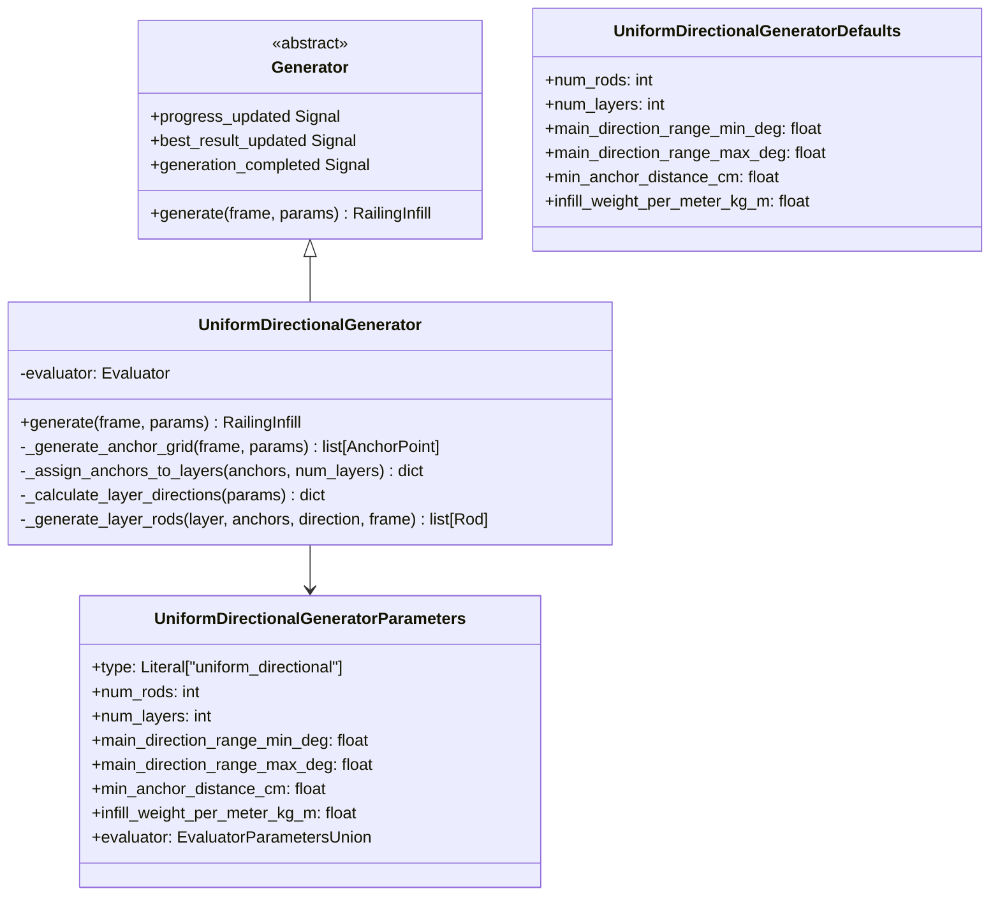

# Design Document: Uniform Directional Generator

## Overview

The Uniform Directional Generator is a deterministic infill generator that creates evenly distributed rod arrangements across configurable layers. Unlike RandomGeneratorV2 which uses randomness for anchor placement and angle variation, this generator produces consistent, predictable patterns through direct mathematical calculation.

### Key Characteristics

1. **Deterministic**: Identical inputs always produce identical outputs
2. **Direct Calculation**: No iteration or random number generation
3. **Uniform Distribution**: Evenly spaced anchors and rods
4. **Layered Directions**: Each layer has a fixed main direction from a configurable range
5. **Fail-Fast**: Fails immediately if constraints cannot be satisfied

### Comparison with RandomGeneratorV2

| Aspect | RandomGeneratorV2 | UniformDirectionalGenerator |
|--------|-------------------|----------------------------|
| Anchor placement | Random offsets | Evenly spaced |
| Angle variation | Random deviation from main direction | Exact main direction |
| Iteration | Multiple attempts to find valid rods | Single pass |
| Reproducibility | Different results each run | Identical results |
| Failure handling | Returns best partial result | Fails with error |

## Architecture

The generator follows the existing generator architecture pattern:



## Components and Interfaces

### UniformDirectionalGeneratorDefaults (Dataclass)

Hydra configuration defaults loaded from YAML:

```python
@dataclass
class UniformDirectionalGeneratorDefaults(InfillGeneratorDefaults):
    num_rods: int = 30
    num_layers: int = 3
    main_direction_range_min_deg: float = -45.0
    main_direction_range_max_deg: float = 25.0
    min_anchor_distance_cm: float = 5.0
    infill_weight_per_meter_kg_m: float = 0.59
```

### UniformDirectionalGeneratorParameters (Pydantic Model)

Runtime parameters with validation:

```python
class UniformDirectionalGeneratorParameters(InfillGeneratorParameters):
    type: Literal["uniform_directional"] = "uniform_directional"
    num_rods: int = Field(gt=0, description="Total number of rods to generate")
    num_layers: int = Field(gt=0, description="Number of rod layers")
    main_direction_range_min_deg: float = Field(
        ge=-90, le=90, description="Minimum angle from vertical"
    )
    main_direction_range_max_deg: float = Field(
        ge=-90, le=90, description="Maximum angle from vertical"
    )
    min_anchor_distance_cm: float = Field(gt=0, description="Minimum anchor spacing")
    infill_weight_per_meter_kg_m: float = Field(gt=0, description="Rod weight per meter")
    evaluator: EvaluatorParametersUnion = Field(discriminator="type")
    
    @model_validator(mode='after')
    def validate_direction_range(self) -> Self:
        if self.main_direction_range_min_deg >= self.main_direction_range_max_deg:
            raise ValueError("min_deg must be less than max_deg")
        return self
```

### UniformDirectionalGenerator Class

Main generator implementation:

```python
class UniformDirectionalGenerator(Generator):
    PARAMETER_TYPE = UniformDirectionalGeneratorParameters
    
    def generate(self, frame: RailingFrame, params: InfillGeneratorParameters) -> RailingInfill:
        """Generate deterministic uniform infill."""
        ...
```

## Data Models

### Parameters

| Parameter | Type | Default | Constraints | Description |
|-----------|------|---------|-------------|-------------|
| type | Literal | "uniform_directional" | Fixed | Generator type identifier |
| num_rods | int | 30 | > 0 | Total rods to generate |
| num_layers | int | 3 | > 0 | Number of layers |
| main_direction_range_min_deg | float | -45.0 | [-90, 90] | Min direction angle |
| main_direction_range_max_deg | float | 25.0 | [-90, 90] | Max direction angle |
| min_anchor_distance_cm | float | 5.0 | > 0 | Minimum anchor spacing |
| infill_weight_per_meter_kg_m | float | 0.59 | > 0 | Rod weight per meter |
| evaluator | EvaluatorParametersUnion | PassThrough | - | Nested evaluator config |

## Algorithm Overview

The generation algorithm consists of four phases executed in a single pass:

### Phase 1: Generate Maximum Anchor Grid

Generate as many anchor points as the minimum distance constraint allows along the entire frame boundary.

**Algorithm:**
1. Calculate total frame perimeter
2. Calculate maximum number of anchors: `max_anchors = floor(perimeter / min_anchor_distance_cm)`
3. Calculate uniform spacing: `spacing = perimeter / max_anchors`
4. Place anchors at regular intervals along frame boundary using Shapely's `interpolate()`
5. All anchors start as "free" (not assigned to any rod)

**Key Difference from V2:** 
- No random offsets - anchors are placed at exact calculated positions
- Generates maximum possible anchors, not just what's needed for requested rods

### Phase 2: Calculate Layer Directions

Compute the main direction for each layer.

**Algorithm:**
1. If `num_layers == 1`: direction = `(min_deg + max_deg) / 2`
2. If `num_layers > 1`: For layer index i (0-based):
   - `t = i / (num_layers - 1)`
   - `direction = min_deg + t * (max_deg - min_deg)`

**Same as V2:** Uses identical formula for direction calculation.

### Phase 3: Generate Line Pattern per Layer

For each layer, calculate a uniform line pattern across the entire frame area at the layer's direction angle.

**Algorithm:**
1. Calculate the frame's bounding box
2. Determine line spacing based on target rods per layer: `rods_per_layer = ceil(num_rods / num_layers)`
3. Generate parallel lines at the layer's main direction angle, evenly spaced across the frame
4. For each line:
   a. Calculate intersections with the frame boundary (typically 2 points)
   b. For each intersection point, find the nearest **free** anchor point
   c. If both anchors are found and different:
      - Create rod connecting the two anchor points
      - Mark both anchors as "used" (no longer free)
   d. If suitable anchors not found, skip this line (don't fail)

**Key Insight:** The line pattern is calculated geometrically first, then "snapped" to available anchors. This ensures uniform visual distribution while respecting the anchor grid.

### Phase 4: Validate and Finalize

Validate the generated rods and create the final result.

**Algorithm:**
1. Verify total rods generated matches requested (or fail if insufficient)
2. Verify no same-layer crossings (should be guaranteed by uniform line pattern)
3. Verify all rods are within frame boundary
4. Run evaluator to calculate fitness score
5. Create RailingInfill with rods, anchor points, and fitness score

**Key Difference from V2:**
- No random angle deviation - uses exact main direction
- Line pattern ensures uniform distribution
- Snapping to anchors ensures minimum distance constraint

## Error Handling

### Validation Errors

| Condition | Error |
|-----------|-------|
| `num_rods <= 0` | Pydantic ValidationError |
| `num_layers <= 0` | Pydantic ValidationError |
| `min_deg >= max_deg` | Pydantic ValidationError |
| `min_anchor_distance_cm <= 0` | Pydantic ValidationError |

### Generation Errors

| Condition | Error |
|-----------|-------|
| Frame too small for requested rods | RuntimeError: "Frame cannot accommodate {num_rods} rods with {min_distance}cm spacing" |
| Rod placement constraint violation | RuntimeError: "Cannot place rod at position {pos}: {reason}" |

## Correctness Properties

*A property is a characteristic or behavior that should hold true across all valid executions of a system-essentially, a formal statement about what the system should do. Properties serve as the bridge between human-readable specifications and machine-verifiable correctness guarantees.*

### Property Reflection

After analyzing the acceptance criteria, I identified the following consolidations:
- Properties 1.1 (determinism) is unique and fundamental
- Properties 1.2, 1.5, 4.2, 4.3 all relate to layer distribution - combined into Property 2
- Properties 1.3, 1.4, 2.4 relate to direction calculation - combined into Property 3
- Properties 3.2, 3.3 relate to anchor spacing - combined into Property 4
- Properties 6.1, 6.3, 6.4 relate to rod constraints - combined into Property 5
- Properties 3.5, 5.5 relate to error handling - combined into Property 6
- Properties 2.6, 2.7 relate to parameter validation - combined into Property 7
- Property 7.2, 7.3 relate to evaluator integration - combined into Property 8

### Property 1: Deterministic Generation

*For any* valid frame and parameters, generating infill twice with identical inputs SHALL produce identical results (same rods with same positions, angles, and layer assignments).

**Validates: Requirements 1.1, 5.2**

### Property 2: Even Layer Distribution

*For any* generated infill with N rods and L layers, the difference between the layer with the most rods and the layer with the fewest rods SHALL be at most 1, and extra rods SHALL be assigned to lower-numbered layers first.

**Validates: Requirements 1.2, 1.5, 4.2, 4.3**

### Property 3: Layer Direction Calculation

*For any* generated infill with L layers and direction range [min_deg, max_deg], each layer's rods SHALL follow the direction calculated by: `direction = min_deg + (layer_index / (L - 1)) * (max_deg - min_deg)` for L > 1, or `(min_deg + max_deg) / 2` for L = 1.

**Validates: Requirements 1.3, 1.4, 2.4, 2.5**

### Property 4: Minimum Anchor Distance

*For any* generated infill, all pairs of anchor points (regardless of layer) SHALL be separated by at least min_anchor_distance_cm.

**Validates: Requirements 3.2, 3.3**

### Property 5: Rod Constraint Satisfaction

*For any* generated infill: (a) no two rods in the same layer SHALL cross, (b) all rods SHALL be completely within the frame boundary, and (c) all rod endpoints SHALL lie on the frame boundary.

**Validates: Requirements 6.1, 6.3, 6.4**

### Property 6: Fail-Fast on Constraint Violation

*For any* parameters where the frame cannot accommodate the requested rods with the minimum distance constraint, generation SHALL fail with an error (not return partial results).

**Validates: Requirements 3.5, 5.5**

### Property 7: Parameter Validation

*For any* parameter values where direction range min >= max, or any value is outside its valid range, parameter creation SHALL raise a validation error.

**Validates: Requirements 2.6, 2.7**

### Property 8: Evaluator Integration

*For any* generated infill with a configured evaluator, the returned RailingInfill SHALL include a fitness_score calculated by that evaluator.

**Validates: Requirements 7.2, 7.3**

## Testing Strategy

### Property-Based Testing

The implementation will use **Hypothesis** for property-based testing, consistent with Python best practices.

Each correctness property will be implemented as a property-based test:
- Tests will be annotated with the format: `**Feature: uniform-directional-generator, Property N: <property_text>**`
- Each property test will run a minimum of 100 iterations
- Generators will produce valid parameter ranges

### Unit Tests

Unit tests will cover:
- Default value loading from configuration
- Factory registration and generator creation
- Edge cases (single layer, single rod, maximum rods)
- Error conditions (invalid parameters, frame too small)

### Test File Structure

```
tests/domain/infill_generators/
├── test_uniform_directional_generator.py           # Unit tests
└── test_uniform_directional_generator_properties.py  # Property-based tests
```

## Configuration Files

### Hydra Configuration

File: `conf/generators/uniform_directional.yaml`

```yaml
num_rods: 30
num_layers: 3
main_direction_range_min_deg: -45.0
main_direction_range_max_deg: 25.0
min_anchor_distance_cm: 5.0
infill_weight_per_meter_kg_m: 0.59
```

## UI Integration

### Parameter Widget

Create `UniformDirectionalGeneratorParameterWidget` following the existing pattern:

**Input Fields:**
- Number of Rods (QSpinBox, min=1)
- Number of Layers (QSpinBox, min=1)
- Direction Range Min (QDoubleSpinBox, -90 to 90)
- Direction Range Max (QDoubleSpinBox, -90 to 90)
- Min Anchor Distance (QDoubleSpinBox, min=0.1)
- Infill Weight per Meter (QDoubleSpinBox, min=0.01)
- Evaluator Type (QComboBox with nested widget)

### Factory Registration

Register in `GeneratorFactory`:
- Key: "uniform_directional"
- Value: UniformDirectionalGenerator class

## Performance Characteristics

### Time Complexity

- Anchor generation: O(N) where N = num_rods * 2
- Layer assignment: O(N)
- Direction calculation: O(L) where L = num_layers
- Rod generation: O(N * L) worst case for crossing checks
- **Total: O(N * L)**

### Memory Usage

- Anchor points: ~N * 64 bytes
- Rods: ~N * 256 bytes
- **Total: < 50 KB for typical cases**

### Comparison with V2

| Metric | RandomGeneratorV2 | UniformDirectionalGenerator |
|--------|-------------------|----------------------------|
| Time complexity | O(N * L * iterations) | O(N * L) |
| Typical iterations | 10-1000 | 1 |
| Expected speedup | - | 10-1000x |

## Summary

The Uniform Directional Generator provides:

1. **Deterministic output** for reproducible production designs
2. **Direct calculation** for fast, predictable generation
3. **Uniform distribution** for visually consistent patterns
4. **Fail-fast behavior** for clear error handling
5. **Full integration** with existing evaluator and UI systems

